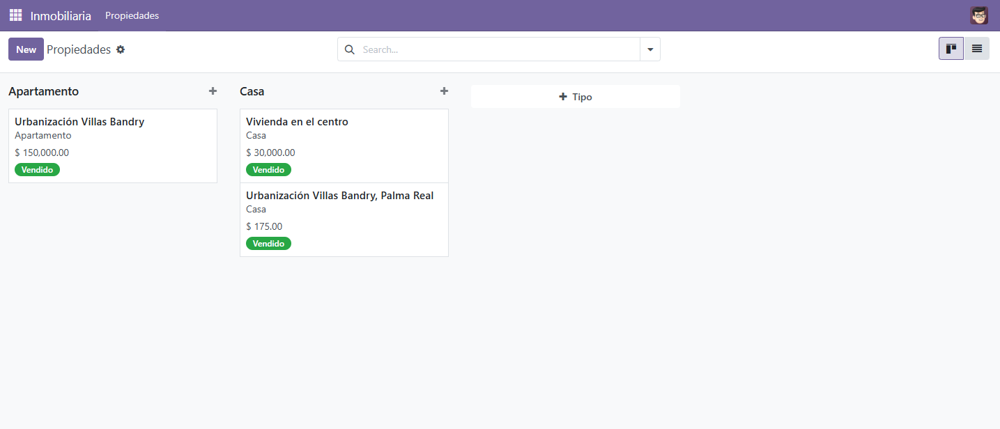
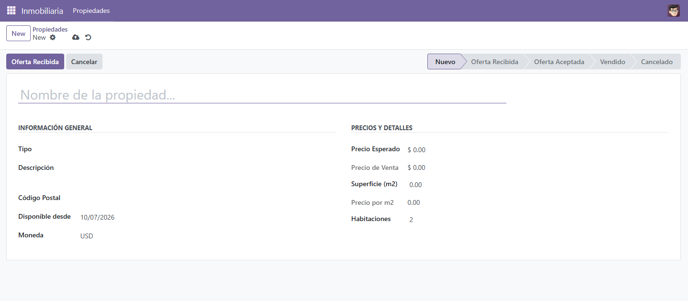
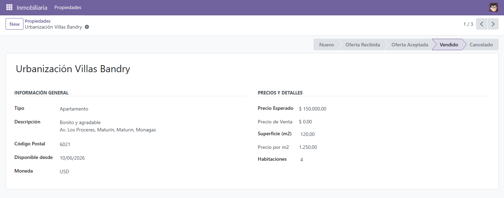
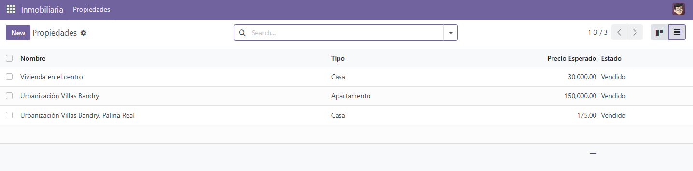
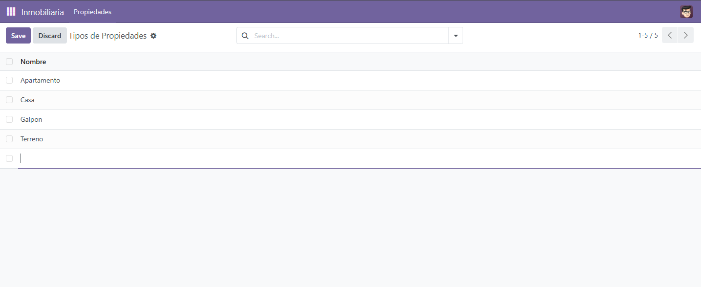

# 🏠 Real Estate Management

Módulo personalizado para **Odoo 17** que permite a agencias inmobiliarias gestionar propiedades, tipos de inmuebles y su ciclo de vida comercial (desde que se publican hasta que se venden o cancelan).

Diseñado como proyecto de aprendizaje práctico siguiendo las convenciones oficiales del framework Odoo.

---

## 📋 Tabla de Contenidos

- [Características](#-características)
- [Requisitos](#-requisitos)
- [Instalación](#-instalación)
- [Uso](#-uso)
- [Estructura del Proyecto](#-estructura-del-proyecto)
- [Modelos de Datos](#-modelos-de-datos)
- [Tecnologías](#-tecnologías)
- [Aprendizajes](#-aprendizajes)
- [Autor](#-autor)

---

## ✨ Características

### Gestión de Propiedades
- ✅ Campos completos: nombre, descripción, código postal, precio esperado, precio de venta, habitaciones, superficie y fecha de disponibilidad.
- ✅ Cálculo automático del **precio por metro cuadrado** al modificar el precio esperado o la superficie.
- ✅ Validación de precio positivo.
- ✅ Relación **Many2one** con el modelo de tipos de propiedad.

### Gestión de Tipos de Propiedad
- ✅ Modelo secundario con vistas de lista y formulario.
- ✅ Creación rápida desde la vista de lista (editable en línea).

### Ciclo de Vida del Inmueble
- ✅ **5 estados** que reflejan el flujo comercial:
  - 🆕 Nuevo
  - 📥 Oferta Recibida
  - ✅ Oferta Aceptada
  - 💰 Vendido
  - ❌ Cancelado
- ✅ Botones de acción contextuales que solo aparecen según el estado actual.
- ✅ Validaciones de negocio: no se puede vender una propiedad cancelada, ni cancelar una vendida.

### Vistas
- 🎨 **Kanban** con agrupación por tipo de propiedad y colores por estado.
- 📊 **Lista (Tree)** con información clave.
- 📝 **Formulario** con barra de estado y grupos organizados.
- 🔍 **Búsqueda** con filtros rápidos (Disponibles, Sin vender, Vendidas, rangos de precio) y agrupadores (por tipo, estado y código postal).

### Seguridad
- 🔒 Permisos configurados mediante `ir.model.access.csv` para usuarios internos.

---

## ⚙️ Requisitos

| Componente | Versión |
|---|---|
| Odoo | 17.0 |
| Python | 3.10 o 3.11 |
| PostgreSQL | 15 o superior |
| PostgreSQL locale | `C` (obligatorio para evitar errores de codificación en Windows) |

---

## 🚀 Instalación

### 1. Clonar el repositorio
```bash
git clone https://github.com/mvictoria-init/practicas_odoo.git
cd real_estate_management

## Capturas del proyecto










